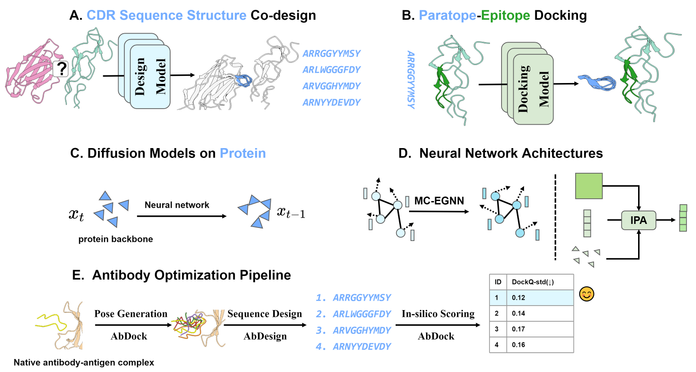

<div align="center">

# Generative Diffusion Models for Antibody Design, Docking, and Optimization


**| [Code](https://github.com/pengzhangzhi/ab_opt) | [Paper](https://www.biorxiv.org/content/10.1101/2023.09.25.559190v1) | [Homepage](https://pengzhangzhi.github.io/ab_opt_homepage/) |**


<!-- [](https://papers.nips.cc/paper/2020) -->

</div>


Official <a href="https://pytorch.org/get-started/locally/"></a>
 implementation of [Generative Diffusion Models for Antibody Design, Docking, and Optimization](https://www.biorxiv.org/content/10.1101/2023.09.25.559190v1).


The wet experiment data used to validate our pipeline is available at [wet_experiment_data.zip](./wet_experiment_data.zip)





## Quick start
### Installation
```bash
git clone git@github.com:pengzhangzhi/ab_opt.git
```

### **Antibody optimization pipeline**

#### want to use it online? Check out the [colab](https://drive.google.com/file/d/1vTNZAl_eJ63vruC4Mkq8t6nr8lwvoaIh/view?usp=sharing) version of the **antibody optimization pipeline**.

#### Running the pipeline in local
- `git clone git@github.com:pengzhangzhi/ab_opt.git`
- Go the [AbDock](./AbDock/) 
- Follow the README to install the env
- Open notebook [ab_opt.ipynb](AbDock/ab_opt.ipynb)
- specify pdb file which contains an antibody-antigen complex structure
- specify the heavy chain ID and the residue indices to be designed

### AbDesign
Please take a look at the [AbDesign](./AbDesign/) on reproducing the training and evaluation of the AbDesign.
### AbDock
Please refer to the [AbDock](./AbDock/) on how to reproduce the training and evaluation of the AbDock and the antibody optimization pipeline.

## Credits <a name = "credits"></a>
This codebase is based on the following repositories, we thank the authors for their great work.
- [DockQ](https://github.com/bjornwallner/DockQ)
- [diffab](https://github.com/luost26/diffab)
- [Abnumber](https://github.com/prihoda/AbNumber)
- [PyRosetta](https://www.pyrosetta.org/)
- ...

